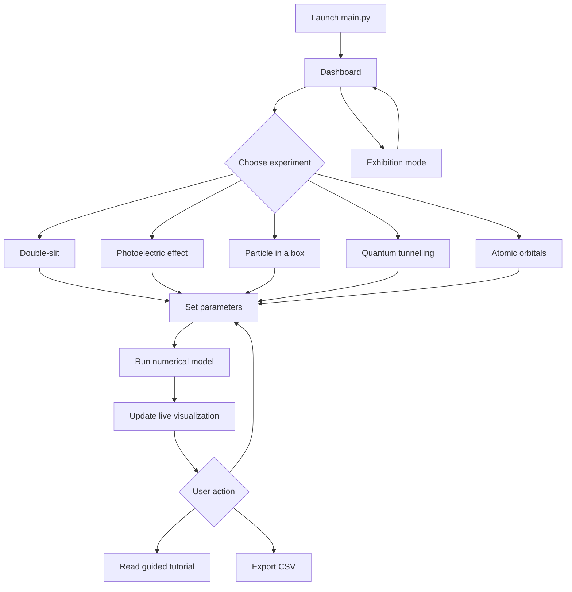

# QUANTUM LAB flowchart

```mermaid
flowchart TD
    A[Launch main.py] --> B[Dashboard]
    B --> C{Choose experiment}
    C --> D[Double-slit]
    C --> E[Photoelectric effect]
    C --> F[Particle in a box]
    C --> G[Quantum tunnelling]
    C --> H[Atomic orbitals]
    D --> I[Set parameters]
    E --> I
    F --> I
    G --> I
    H --> I
    I --> J[Run numerical model]
    J --> K[Update live visualization]
    K --> L{User action}
    L --> I
    L --> M[Read guided tutorial]
    L --> N[Export CSV]
    B --> O[Exhibition mode]
    O --> B
```
